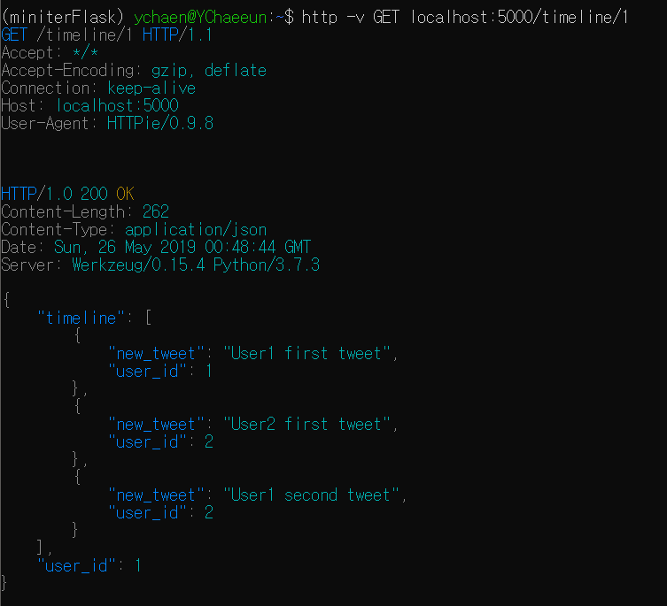

## mini twitter

- 트위터 기능 구현해보기
- 책 <깔끔한 파이썬 탄탄한 백엔드>  참고

- [ychae-leah 티스토리 블로그](https://ychae-leah.tistory.com/category/프로젝트/Flask_mini twitter)에서 진행과정을 보실 수 있습니다

## tool & environment

- python 3.7  / ubuntu
- flask
- MySQL

## feature

- API 구현
- 회원가입 / 로그인 기능 구현
- 300자 제한 트윗 올리기
- 팔로우 언팔로우
  - customEncoder 구현
- 전체 목록 가져와서 보여주기

## 향후 할 것

- Bootstrap / HTML / CSS 로 화면 구성하기
- AWS 서버 배포하기
- MySQL DB 연동하기

